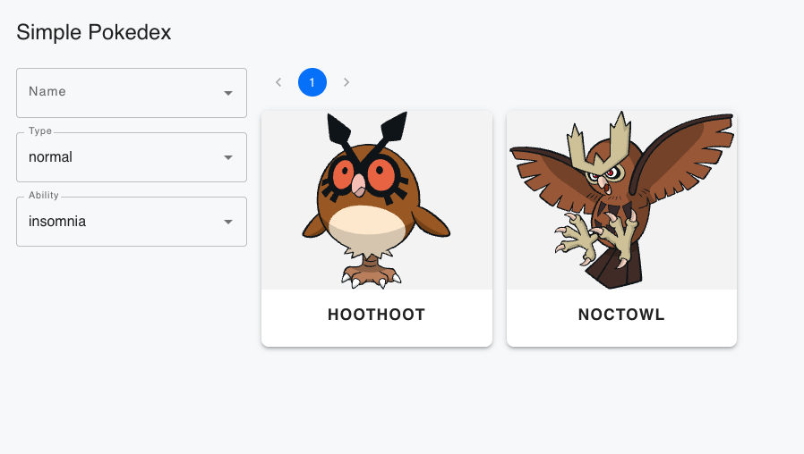

# Hortifrut Challenge

Hola! Bienvenidos a mi solución para el reto técnico de Hortifrut usando la API de Pokemon.

Pueden encontrar mi solución deployada en los siguientes links:

- Frontend: https://simple-pokedex-one.vercel.app/
- Backend: https://hortifrut-challenge.vercel.app



## Ejecución en local

1. Dentro de la carpeta `backend`, copia el archivo `.env.sample` a `.env`
2. Usa docker compose para levantar los servicios de la siguiente manera:
```
docker compose -f compose.dev.yaml build
docker compose -f compose.dev.yaml up -d
```
3. Accede a la aplicación frontend en el siguiente link: http://localhost:3001

## Stack

A continuación se detalla el stack tecnológico usado:

- Backend: Express.JS, TypeScript, Tsyringe (inyección de dependencias)
- Infraestructura: Docker, Vercel, Redis
- Frontend: React.js
- Test: Jest
- CI/CD: GitHub Actions (incluye linter, test, build y deploy automático a Vercel)

## Características principales

- El backend utiliza Redis como caché para almacenar por 1 día los resultados de las llamadas a la API de Pokemon. Esto permite reducir el tiempo de respuesta considerando que los datos no cambian con frecuencia. Para producción, estoy tomando ventaja de la [integración gratis de Redis en Vercel](https://vercel.com/marketplace/redis) (hasta 30 MB).
- El backend expone 3 endpoints:
  - `/pokemon?ability=1&type=1`: Devuelve una lista de pokemones filtrando por habilidad y tipo. La PokeAPI original no tiene un mecanismo para multifiltro por lo que se hizo una implementación propia haciendo llamadas a la API de Pokemon y filtrando los resultados.
  - `/pokemon/:id`: Devuelve un pokemon específico con sus detalles.
  - `/ability`: Devuelve todas las habilidades disponibles en la API de Pokemon.
  - `/type`: Devuelve todos los tipos disponibles en la API de Pokemon.
- El frontend implementado con React.js permite filtrar por habilidad y tipo, además de mostrar los detalles de un pokemon al hacer click en su tarjeta
- El frontend tiene implementado pruebas unitarias con Jest.
- Debido a limitaciones de tiempo, no pude implementar pruebas unitarias para el backend. Sin embargo, la lógica de negocio está separada en servicios y controladores, e hice uso de técnicas de inyección de dependencias para facilitar la testabilidad. En un escenario real, implementaría pruebas unitarias para asegurar la calidad del código.
- El CI/CD está implementado con GitHub Actions, incluye un linter y pruebas unitarias que se ejecutan en cada push a la rama `main` y que bloquean el deploy a producción si alguna de estas falla garantizando la calidad del código. De igual forma, el deploy a producción se hace automáticamente al hacer un push a la rama `main` de la aplicación frontend y backend.
